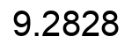

# Async vs Thread Scraping

This project compares the efficiency and performance of different methods for making HTTP requests in Python for web scraping purposes. Specifically, it compares :

1. **A normal for-loop** to iterate over each link sequentially.
2. **Asyncio** for asynchronous requests using AIOHttp.
3. **Python ThreadPoolExecutor** to manage multiple threads for making concurrent requests.

The goal is to understand how these different methods perform when making several thousand HTTP requests, and how each method scales in terms of speed and efficiency.

## Demo Server Setup

We are using a demo server hosted locally via **FastAPI**. The server exposes basic endpoints that simulate responses to HTTP requests.

While server response times will be minimal locally, the goal is to simulate real-world conditions in which external server delays compound.

The server endpoints will be hit `TOTAL_REQUESTS_COUNT` times (as defined in `scraper_config.py`) in the benchmarking process to simulate high-load requests.

## Project Structure

```bash
Async-vs-Thread-Scraping/
├── .gitignore             # Specifies files and directories to be ignored by git
├── .python-version        # Specifies Python version to be used
│
├── app
│   └── server_api.py      # FastAPI app definition and endpoints
│
├── benchmark.sh           # Automates running benchmark tests for scrapers
├── benchmark_result.txt   # Stores benchmark results (time per scraper iteration)
│
├── config
│   └── scraper_config.py  # Stores TOTAL_REQUESTS_COUNT to set the request limit
│
├── LICENSE                # Licensing information
│
├── pyproject.toml         # Python project configuration (dependencies, etc.)
│
├── README.md              # Project documentation
│
├── scraper
│   ├── async_scraper.py   # Asynchronous scraping using asyncio and AIOHttp
│   ├── sync_scraper.py    # Synchronous scraping using for-loop
│   └── thread_scraper.py  # Threaded scraping using ThreadPoolExecutor
│
├── static
│   └── timer_{0..3}.png   # Images representing benchmark results for scrapers
│
├── utils
│   └── result_images.py   # Generates images from benchmark_result.txt
│
└── uv.lock                # uv Lock file for dependencies/environments
```

## Installation & Setup Instructions

### Installation

1. **Clone the repository :**

   ```bash
   git clone https://github.com/jishnukoliyadan/Async-vs-Thread-Scraping.git
   cd Async-vs-Thread-Scraping
   ```

2. **Sync project dependencies using [AStRAL's uv](https://docs.astral.sh/uv/)**

   - [Install uv](https://docs.astral.sh/uv/getting-started/installation/#installing-uv) if you haven't already. Then, run the following command to set up the environment :

     ```bash
     uv sync
     ```

### Running the FastAPI Demo Server

- ```bash
   uv run app/server_api.py
  ```

- The server will be running locally at `http://127.0.0.1:8000`. We can test the endpoints by navigating to `http://127.0.0.1:8000/products/<integer>` in our browser or using a tool like Postman or curl.

### Running the Scrapers

The scraper has been divided into three different scripts for comparison: synchronous, multithreading, and asynchronous approaches.

1. **Set the `PYTHONPATH` to our project root directory :**

   ```bash
   export PYTHONPATH=$(pwd)
   ```

1. **Synchronous Scraper :** Run the scraper using a for-loop (synchronous approach) :

   ```bash
   uv run scraper/sync_scraper.py
   ```

1. **Threaded Scraper :** Run the scraper using `ThreadPoolExecutor` (multithreading approach) :

   ```bash
   uv run scraper/thread_scraper.py
   ```

1. **Asynchronous Scraper :** Run the scraper using `asyncio` with `AIOHttp` (asynchronous approach) :

   ```bash
   uv run scraper/async_scraper.py
   ```

These above scripts will send requests to the demo server based on the configuration in `scraper_config.py`, where we can set the total number of requests (`TOTAL_REQUESTS_COUNT`) to be sent to the server.

## Results and Performance

### Performance

- **Total Time Taken** : How long each scraping method took to complete, this is the **Benchmark Parameter**.

- Edit the `TOTAL_REQUESTS_COUNT` variable in `config/scraper_config.py` to set the number of requests you want to benchmark.

- To generate performance benchmark, use the below code.

  ```bash
  bash benchmark.sh 10 # Read below Note for the meaning of "10"
  ```

  **Note :**

  - The `10` represents the number of iterations each scraper script (`sync_scraper`, `thread_scraper`, `async_scraper`) will run.

  - If you don't specify a number, the script will default to running the scrapers 5 times.

### Results

| Request Count :  |     sync_scraper.py     |    thread_scraper.py    |    async_scraper.py     |
| :-------------------------------------: | :---------------------: | :---------------------: | :---------------------: |
|       Average Run Time (seconds)        |  |  |  |

> These results will help determine which scraping approach is most efficient based on the load.

## License

This project is licensed under the MIT License - see the [LICENSE](LICENSE) file for details.
